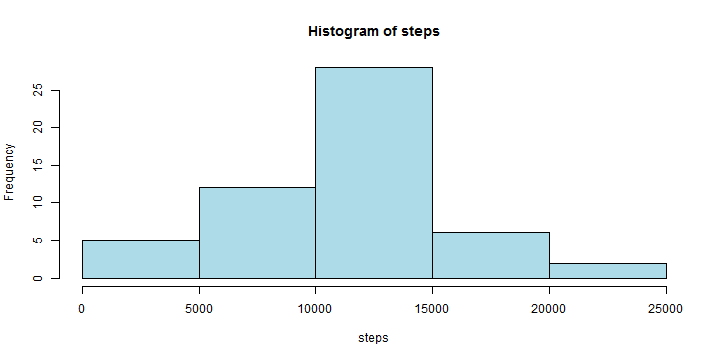
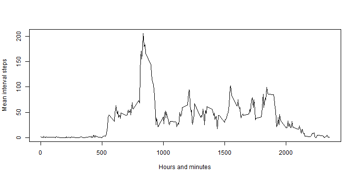
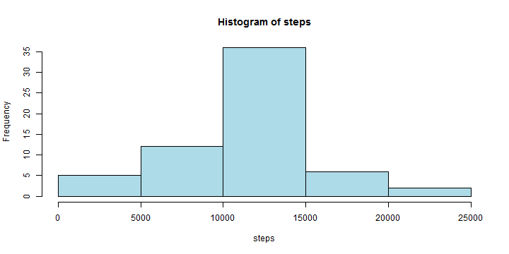
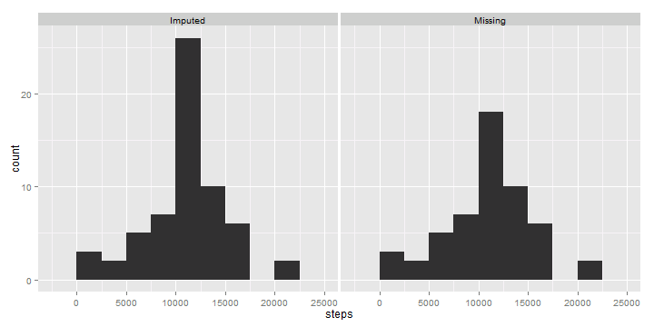
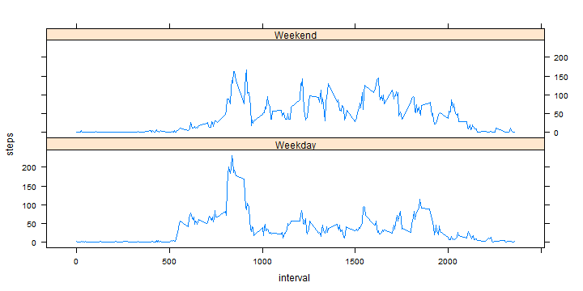

# Reproducible Research: Peer Assessment 1


## Loading and preprocessing the data

Locate the activity.zip file and unzip it to a new directory called activity.


```r
# load the required libraries
library(ggplot2)
library(lattice)

# read the CSV file
activity = read.table("activity/activity.csv", sep = ",", header = T)
```

```
## Warning: cannot open file 'activity/activity.csv': No such file or
## directory
```

```
## Error: cannot open the connection
```


## What is mean total number of steps taken per day?

Firstly, a new column for calendar day (of type Date) will be added to the data 
frame. Then the `aggregate` function will be applied (by default it ignores NA 
values) to get daily totals for the number of steps. From these, the mean and 
median can easily be computed.


```r
# add day column
activity$CalDay = as.Date(activity$date, format = "%Y-%m-%d")

# auxiliary variables for use by aggregate
actSteps <- subset(activity, select = steps)
actCalDay <- subset(activity, select = CalDay)

# aggregate by day
actDailySteps <- aggregate(actSteps, actCalDay, sum)
```


The histogram can now be drawn.


```r
# draw a histogram using *base* graphics
with(actDailySteps, hist(steps, col = "lightblue"))
```

 


From the daily aggregates, we compute that the mean is 
1.0766 &times; 10<sup>4</sup> and the median is 
1.0766 &times; 10<sup>4</sup>. In both cases, NA values for entire 
days were ignored.

## What is the average daily activity pattern?

Now we `aggregate` by interval, noting that the interval can be interpreted 
as a time of day in the format `HHMM` once it has been zero-padded to length 4.


```r
# aggregate by interval
actInterval <- subset(activity, select = interval)
actIntervalSteps <- aggregate(actSteps, actInterval, mean, na.rm = T)

# max value?
maxVal = max(actIntervalSteps$steps)

# occurring at?
maxAt = actIntervalSteps[which.max(actIntervalSteps$steps), "interval"]

# or in 24h notation:
maxZeroPad = sprintf("%04d", maxAt)
max24h = paste(substr(maxZeroPad, 1, 2), substr(maxZeroPad, 3, 4), sep = "h")
```


A time-series line chart for the interval step totals is shown below.


```r
plot(actIntervalSteps$steps ~ actIntervalSteps$interval, type = "l", xlab = "Hours and minutes", 
    ylab = "Mean interval steps")
```

 


The maximum value of 206.1698 occurs at 08h35. This is in agreement 
with the time-series plot.  
As a final check, only a single record should be returned by the following:


```r
# checking the max value - we expect to see only a single record
subset(actIntervalSteps, steps > maxVal - 0.001)
```

```
##     interval steps
## 104      835 206.2
```


## Imputing missing values

There are 2304 missing values.  
The following strategy is used to impute missing values.
1. Create new data frame intervalSteps as "copy" of actIntervalSteps with steps 
   renamed to meanSteps.
2. Merge activity with intervalSteps to get a new data frame impActivity.
3. In the new data frame, substitute the mean step value (over the interval) for
   any and all missing step values. Leave other step values as-is.
4. Use aggregate to get impDailySteps in similar fashion to actDailySteps.


```r
# create a 'copy' of the daily aggregate data frame
impMeanSteps <- data.frame(interval = actIntervalSteps$interval, meanSteps = actIntervalSteps$steps)

# merge from activity to data frame for aggregates
impActivity <- merge(x = activity, y = impMeanSteps, by.x = "interval", by.y = "interval", 
    all = F)

# substitute mean value for missing values
impActivity$steps <- ifelse(is.na(impActivity$steps), impActivity$meanSteps, 
    impActivity$steps)

# sum steps over CalDay values
impSteps <- subset(impActivity, select = steps)
impCalDay <- subset(impActivity, select = CalDay)
impDailySteps <- aggregate(impSteps, impCalDay, sum)
```


The histogram for daily step totals (with imputed values) is shown below.


```r
with(impDailySteps, hist(steps, col = "lightblue"))
```

 


It is not easy to compare this with the histogram drawn for the case where 
missing values were not filled in. To do this, I will show a side-by-side 
comparison.


```r
actDailySteps$type = "Missing"
impDailySteps$type = "Imputed"
combDailySteps = data.frame(CalDay = as.Date(character()), steps = integer(), 
    type = character(), stringsAsFactors = F)
combDailySteps <- rbind(combDailySteps, actDailySteps, impDailySteps)
combDailySteps <- transform(combDailySteps, type = factor(type))
```


```r
qplot(steps, data = combDailySteps, facets = . ~ type, binwidth = 2500)
```

 


It is clear that the major difference between the histograms for the "missing"
and "imputed" datasets is that the "imputed" dataset has a larger peak in the 
bin from 10000 to 12500. The way values were imputed means that each day for 
which all values were missing will now have the same total step count, which is
10766.19.

## Are there differences in activity patterns between weekdays and weekends?

Firstly, add a weekday column (and weekend status factored column) to the 
"imputed" dataset. Then aggregate by combinations of interval and weekend status.


```r
impActivity$weekday <- weekdays(impActivity$CalDay)
impActivity$weekendStatus <- ifelse(substr(impActivity$weekday, 1, 1) == "S", 
    1, 0)

impWeekdayStatusMeanSteps <- NULL
impWEStatusMean <- aggregate(steps ~ interval + weekendStatus, data = impActivity, 
    mean)
impWEStatusMean <- transform(impWEStatusMean, weekendStatus = factor(weekendStatus, 
    labels = c("Weekday", "Weekend")))
```


Finally, the time-series chart for weekend and weekday facets is shown below. 
There is a discernible difference between the trends for weekdays and for 
weekends.  
The results can be explained as follows:
* there is less activity in the early morning on weekend days because 
  people take it easy
* people move around more in the middle of weekend days as they are not 
  desk-bound


```r
xyplot(steps ~ interval | weekendStatus, data = impWEStatusMean, layout = c(1, 
    2), type = "l")
```

 


